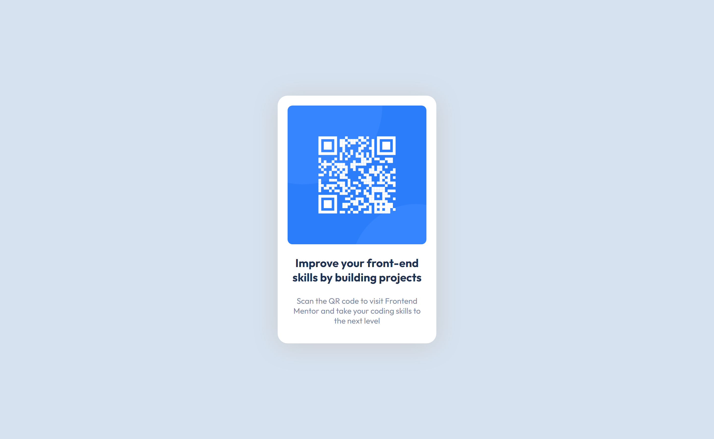

# Frontend Mentor - QR code component solution

This is a solution to the [QR code component challenge on Frontend Mentor](https://www.frontendmentor.io/challenges/qr-code-component-iux_sIO_H). Frontend Mentor challenges help you improve your coding skills by building realistic projects. 

## Table of contents

- [Overview](#overview)
  - [Screenshot](#screenshot)
  - [Links](#links)
- [My process](#my-process)
  - [Built with](#built-with)
  - [What I learned](#what-i-learned)
  - [Useful resources](#useful-resources)
- [Author](#author)

## Overview

The Project is a simple one utilizing basic html and css. I was able to use my knowledge of html and css to get this done

### Screenshot

### Links

- Solution URL: [Github Repo](https://github.com/efewizzy/01---QR-code-component/upload)

## My process

### Built with

- Semantic HTML5 markup
- CSS custom properties

### What I learned

I didn't learn anything new as i already know how to use html5 and css3. I was able to recap on how to use box shadows and centering a div on a page.

### Useful resources

- [Box Shadow](https://developer.mozilla.org/en-US/docs/Web/CSS/box-shadow) - This helped me on how to add shadows to boxes using css. I really liked this pattern and will use it going forward.
- [Centering Div's](https://blog.hubspot.com/website/center-div-css) - This is an amazing article which helped me finally understand how to center div's on a page horizontally and vertically. I'd recommend it to anyone still learning this concept.
- [Media Queries](https://developer.mozilla.org/en-US/docs/Web/CSS/Media_Queries/Using_media_queries) - This helped me on how to use media queries. It was really explanatory and is recommended for anyone still learning this concept.

## Author

- Frontend Mentor - [@efewizzy](https://www.frontendmentor.io/profile/efewizzy)

